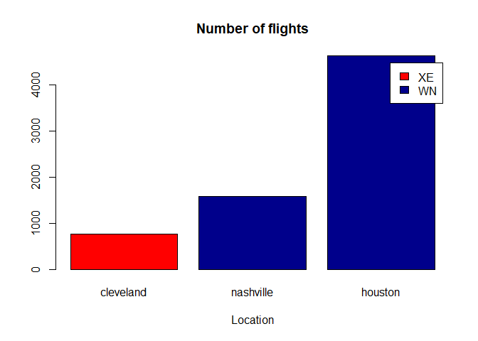
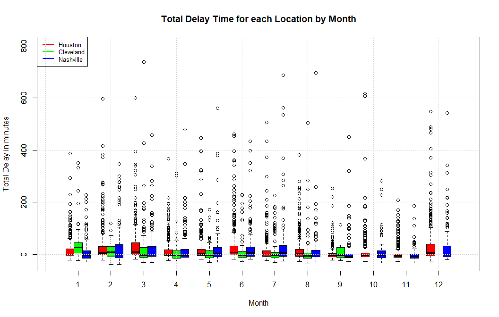
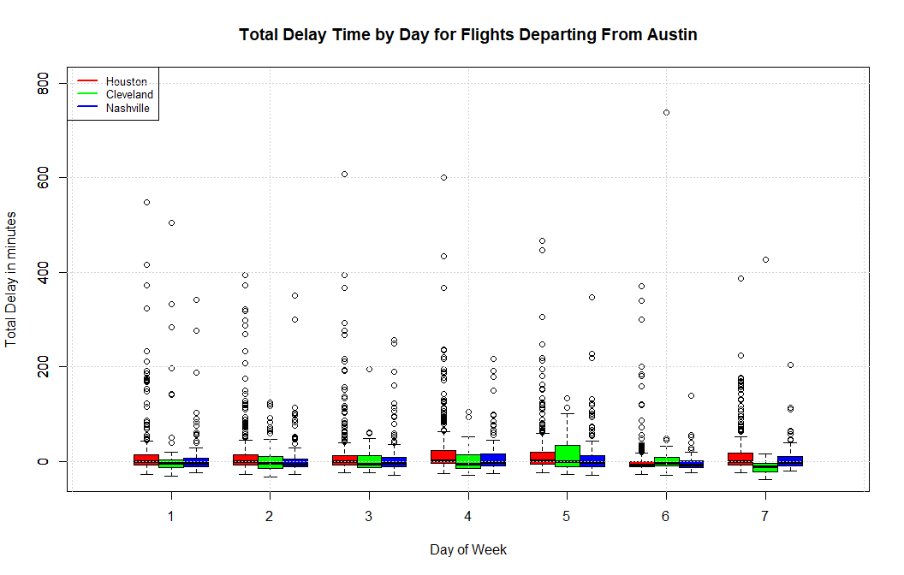
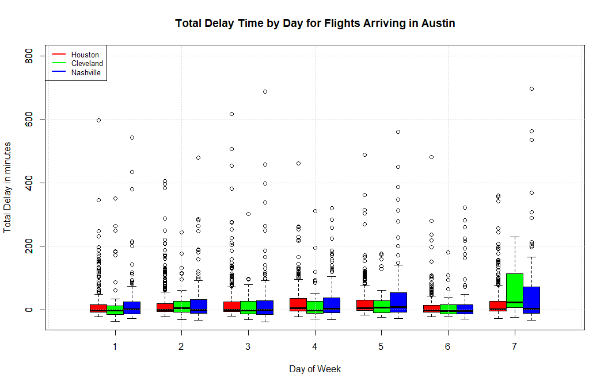
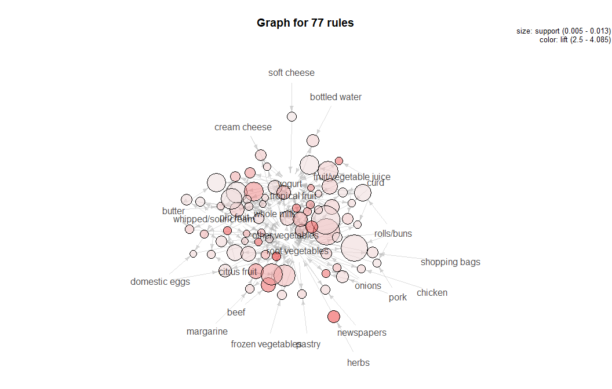

Problem 1 - Flights at ABIA
---------------------------

#### I have family that lives in Cleveland, in Houston and in Nashville. I am regularly taking trips to see them. I want to use the Austin airport data to help me plan my trip. First, I'd like to look at which carriers fly directly to these locations, and the number of flights to each location per year:

#### Looks like I don't have that many choices of carriers if I want direct flights to these locations. It also looks like the largest number of flights exist between Austin and Houston. Now I want to use this data to understand when I should plan trips to these 3 cities to avoid delays. First let's take a look at the total delay time for flights going to or returning from each of these cities by month. This will help me understand what time of year I should plan my trips:

#### From this plot, I can see that the best time to travel to Houston is probably sometime in the fall if I want to avoid delays (sept, oct and november) seem to have the least variability and most common occurances around 0 minutes for delay. For travelling to Nashville I can see that January, September and November would be the optimal time for a trip. In these months, it looks like flights tend to leave a bit early and do not have as many delays as other months. Unfortunately, it looks like direct flights to Cleveland ceased in September of 2008, so I might not be able to get a direct flight here anymore, but when they were occuring, it looks like the best months to travel would have been over the summer (specifically July and August) if I wanted the shortest delay.

#### Now let's take a look at the days of the week with the shortest delays for flights TO each city from Austin and flights FROM each city from Austin. This should tell me what days to leave and what days to return in order to avoid delays. First, let's look at delays of flights leaving Austin by destination location/day of the week.

#### From the plot above I can see that the best days to leave Austin for Cleveland are Sunday (day 7) and Monday (day 1), which tend to have flights that leave early. The best day to leave Austin for Houston is Saturday. The best day to leave Austin for Nashville looks to be Saturday or Tuesday - but most of the days seem flights are generally on time. In fact, this seems to be the case for most of the flights departing Austin for these cities. Let's see how flights arriving in Austin from these cities look like. This should give some details on what days of the week I should return to Austin to avoid delays.

#### From the plot above, it seems like the best days to arrive in Austin from Cleveland are either Monday (day 1) or Saturday (day 6). Also from the plot I can see that the day to avoid arriving in to Austin from Cleveland is Sunday, which seems to have a larger number of delays on average. The best days to arrive from Houston look to be Monday, Tuesday or Saturday. The best days to arrive from Nashville look to be Monday or Saturday and similarly to Cleveland, it seems that arriving from Nashville on Sunday tends to have larger delay times.

Problem 2 - Author Attribution
------------------------------

#### To solve this problem, first I pulled all of the text out of the list of documents & created a corpus for the training data and the test data. I turned the corpuses into term matrices and then calculated TF-IDF weights. To avoid errors later on, I made sure that the test term matrix contained the same words as the training term matrix. Next, I took the training TF-IDF matrix and I fit PCA on it. From here I plotted PVE.

    library(tm)
    library(tidyverse)
    library(glmnet)

    #Wrapper function
    readerPlain = function(fname){
      readPlain(elem=list(content=readLines(fname)), 
                id=fname, language='en') }

    author_dirs_train = Sys.glob('~/ReutersC50/C50train/*')
    author_dirs_test = Sys.glob('~/ReutersC50/C50test/*')

    file_list_train = NULL
    labels = NULL
    for(author in author_dirs_train) 
    {
      author_name = substring(author, first = 46)
      files_to_add = Sys.glob(paste0(author, '/*.txt'))
      file_list_train = append(file_list_train, files_to_add)
      labels = append(labels, rep(author_name, length(files_to_add)))
    }

    #Getting rid of '.txt' from filename
    all_docs_train = lapply(file_list_train, readerPlain) 
    names(all_docs_train) = file_list_train
    names(all_docs_train) = sub('.txt', '', names(all_docs_train))
    train_name = labels

    file_list_test = NULL
    labels = NULL
    for(author in author_dirs_test) 
    {
      author_name = substring(author, first = 45)
      files_to_add = Sys.glob(paste0(author, '/*.txt'))
      file_list_test = append(file_list_test, files_to_add)
      labels = append(labels, rep(author_name, length(files_to_add)))
    }

    #Getting rid of '.txt' from filename
    all_docs_test = lapply(file_list_test, readerPlain) 
    names(all_docs_test) = file_list_test
    names(all_docs_test) = sub('.txt', '', names(all_docs_test))

    my_corpus = Corpus(VectorSource(all_docs_train))
    test_corpus = Corpus(VectorSource(all_docs_test))

    my_corpus = tm_map(my_corpus, content_transformer(tolower)) # make everything lowercase
    my_corpus = tm_map(my_corpus, content_transformer(removeNumbers)) # remove numbers
    my_corpus = tm_map(my_corpus, content_transformer(removePunctuation)) # remove punctuation
    my_corpus = tm_map(my_corpus, content_transformer(stripWhitespace)) ## remove excess white-space
    my_corpus = tm_map(my_corpus, content_transformer(removeWords), stopwords("SMART"))

    test_corpus = tm_map(test_corpus, content_transformer(tolower)) # make everything lowercase
    test_corpus = tm_map(test_corpus, content_transformer(removeNumbers)) # remove numbers
    test_corpus = tm_map(test_corpus, content_transformer(removePunctuation)) # remove punctuation
    test_corpus = tm_map(test_corpus, content_transformer(stripWhitespace)) ## remove excess white-space
    test_corpus = tm_map(test_corpus, content_transformer(removeWords), stopwords("SMART"))

    DTM_train= DocumentTermMatrix(my_corpus)

    DTM_train = removeSparseTerms(DTM_train, 0.975)

    #use same terms in test and train
    DTM_test= DocumentTermMatrix(test_corpus,control = list(dictionary=Terms(DTM_train)))

    #change to matrix
    X = as.matrix(DTM_train)
    X_test = as.matrix(DTM_test)

    #Calculate TDF-IDF Weights
    N = nrow(X)
    N_test = nrow(X_test)
    D = ncol(X)
    D_test = nrow(X_test)
    TF_mat = X/rowSums(X)
    TF_mat_test = X_test/rowSums(X_test)
    IDF_vec = log(1 + N/colSums(X > 0))
    IDF_vec_test = log(1 + N_test/colSums(X_test > 0))

    TFIDF_mat = sweep(TF_mat, MARGIN=2, STATS=IDF_vec, FUN="*")  
    TFIDF_mat_test = sweep(TF_mat_test, MARGIN=2, STATS=IDF_vec_test, FUN="*")  

    #Let's use PCA to find the most important components
    pc2 = prcomp(TFIDF_mat, scale=TRUE)

    #plot PVE
    pve = summary(pc2)$importance[3,]
    plot(pve)

#### Based on the PVE plot above, I decided to use the top 250 components. The next step was to fit a model using these 250 components on the training set. To do this, I determined a lasso model using the PCA training data & found the optimal lambda using k=10 cross-validation. Next, I turned the test data into PCA format and took the top 250 components. I predicted the author on the test set using the test PCA data and the model fit on the training set. I then created a confusion matrix and calculated the following percentage of correct predictions:

    #Let's see if we can get 250 components to work...
    n=250
    PCX = pc2$x[,1:n]

    #get the test names of the authors
    test_name = labels

    #Lasso
    out1 = cv.glmnet(PCX, train_name, family='multinomial', type.measure="class", nfolds=10)

    #find optimal lambda
    #plot(out1$lambda, out1$cvm)
    lambda_hat = out1$lambda.min

    #get lasso fit
    glm1 = glmnet(PCX, train_name, family='multinomial')

    #get test data into PCA format
    test.data <- predict(pc2, newdata = TFIDF_mat_test)
    test.data <- as.matrix(test.data)
    test.data <- test.data[,1:250]

    #predict using lasso who the author is
    Lasso.Predict = predict(glm1, s = lambda_hat, newx =test.data, type = "response")
    Lasso.Predict = data.frame(Lasso.Predict)
    colnames(Lasso.Predict) = unique(labels)

    #create a confusion matrix
    lasso.preds = colnames(Lasso.Predict)[apply(Lasso.Predict, 1, which.max)]
    Confusion = table(lasso.preds, test_name)

    #calculate number of correct predictions
    correctsum=0
    i=1

    for(i in 1:length(Confusion[,1])) 
    {
      correctsum = correctsum+Confusion[i,i]
    }
    correctpreds = correctsum/length(lasso.preds)
    library(gridExtra)
    library(grid)
    grid.table(round(correctpreds,digits=6))

#### Finally, let's try Naive-Bayes on the dataset. For this, I fit a Naive Bayes model on the the top factors coming out of PCA for the training data, then predicted on the PCA factors for test. This gave a correct prediction rate which can be see below the code snip.

    library(plyr)
    library(e1071)
    #fit a naiveBayes model on TFIDF matrix
    train_df = data.frame(cbind(PCX, train_name))
    NB = naiveBayes(train_name~., data = train_df)
    NB.pred = predict(NB, newdata = test.data)
    conf_matrix <- table(NB.pred, test_name)

    #calculate correct predictions
    correctsumNB=0
    i=1

    for(i in 1:length(conf_matrix[,1])) 
    {
      correctsumNB = correctsumNB+conf_matrix[i,i]
    }
    correctpredsNB = correctsumNB/length(NB.pred)

    library(gridExtra)
    library(grid)
    grid.table(round(correctpredsNB,digits=6))

#### In this case, using PCA combined with lasso seems to do a much better job of predicting author with an accuracy around 50%, when the baseline accuracy is .02. With Naive Bayes I was unable to produce an accuracy that could significantly beat the baseline accuracy. Therefore, I prefer the PCA combined with lasso. The ineffectiveness of Naive Bayes in this case could have been due to the fact that there is probably some correlation amoungst features and Naive Bayes takes all features as independent. The Naive Bayes method was perhaps not the best to use with continuous features.

Problem 3 - Practice with Association Rule Mining
-------------------------------------------------

#### For this problem, let's first plot the rules output of the apiori algorithm based on lift, support & confidence

#### From this plot, let's pick a range of variables that will give us rules with decent support, confidence & lift. Let's try support&lt;.015, confidence &gt; .35 and lift &gt;2.5

#### From this plot, we can see some clear associations between dairy products - such as butter, sour cream, yogurt & milk. We also see clusterings of fruit and vegetables, meaning purchases of one kind of these items are associated to other kinds of these items. We can also see that there are some items such as whole milk, vegetables & fruit are common in all baskets.
